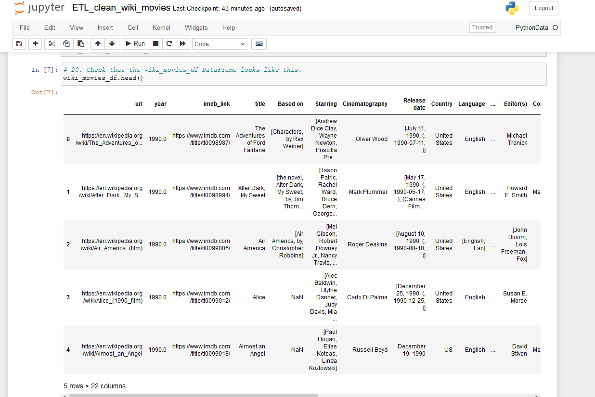
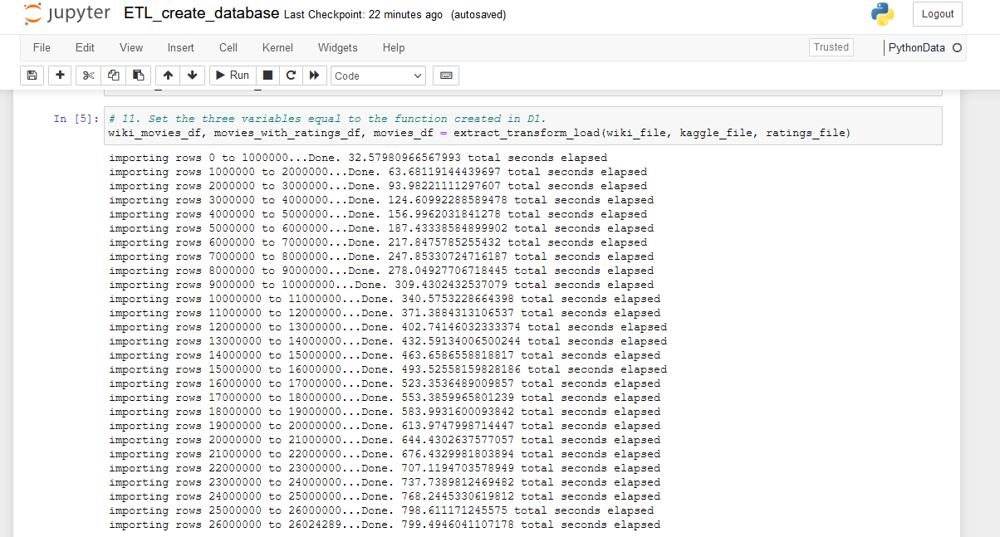

# Challenge_8

This written analysis contains two sections:

**1. Overview of the analysis**

**2. Results**
 
## 1. Overview of the analysis

The aim of the analysis was to help Britta to create an automated pipeline that takes in new data, performs the appropriate transformations, and loads the data into existing tables. This is done by refactoring the code from this module to create one function that takes in the three files—**Wikipedia data**, **Kaggle metadata**, and the **MovieLens rating** data—and performs the ETL process by adding the data to a PostgreSQL database.

The analysis is to help **Amazing Prime** automate this dataset on a daily basis.

## 2. Results

The results primarily highlight the list of four technical analysis deliverables,
### **a. Write an ETL Function to Read Three Data Files:**

The aim was to generate a function that reads in the three data files and creates three separate DataFrames by using Python, Pandas, the ETL process, and code refactoring, 

*a. Wiki_Movies_Df*

*b. Kaggle_Df*

*c. Ratings_Df*

### **b. Extract and Transform the Wikipedia Data:**

The aim was to extract and transform the Wikipedia data so you can merge it with the Kaggle metadata.

The final output is as follows. One note here is that in the module the `Budget' column is repeated twice which has been merged into a single column here.

*d. Wiki_Movies_Df*

*e. Wiki_Movies_Df Columns*

### **c. Extract and Transform the Kaggle Data:**

The focus was to extract and transform the Kaggle metadata and MovieLens rating data, then convert the transformed data into separate DataFrames. Then, the Kaggle metadata DataFrame is merged with the Wikipedia movies DataFrame to create the `movies_df` DataFrame. Finally, the MovieLens rating data DataFrame is merged with the movies_df DataFrame to create the `movies_with_ratings_df`. 

*f. Movies with Rating*

*g. Movies_Df*

### **d. Create the Movie Database:**

The focus was to add the `movies_df` DataFrame and MovieLens rating CSV data to a SQL database.

*h. Import times*

*i. Movies_query*

*j. ratings_query*
